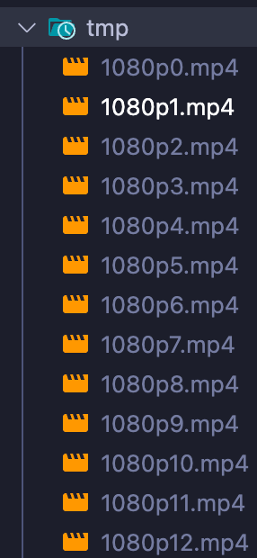
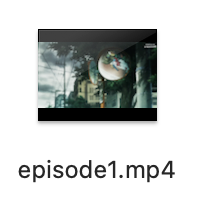

# M3U8 Video Downloader

This Golang program downloads videos from online sources that provide them in the M3U8 format and saves them as MP4 files.

The program downloads only the highest resolution video, which is the first resolution listed in the m3u8 playlist.

I created this program because my internet connection is very slow, which causes video buffering (pausing and playing) when I watch videos online. Downloading videos allows me to watch them locally without interruptions. Additionally, I wanted to practice Golang, so I wrote this program in that language.

This program is intended for personal use to download videos for offline viewing and later deletion only.

## Features

- Downloads videos from M3U8 playlists.
- Saves videos in MP4 format for offline playback.
- Currently selects the first video segment (potentially highest resolution) in the playlist. Consider adding an option for users to choose the desired resolution.

## Prerequisites

FFmpeg must be installed and accessible via the `$PATH` environment variable.

e.g.

- `sudo apt install ffmpeg` on Debian/Ubuntu
- `brew install ffmpeg` on OS X

## Usage

Require 2 arguments: `./video-downloader <m3u8_url> <output_file_name>`

`.mp4` file extension not required in output file name.

```shell
./video-downloader https://stream.animeorder.com/file/icI2HoiQ/ episode1    
```

During download, a temporary directory will be created for store video segments. This directory will be deleted after the download is finished.

result

| Temporary files during download   | Output file      |
|-----------------------------------|------------------|
|  |  |
